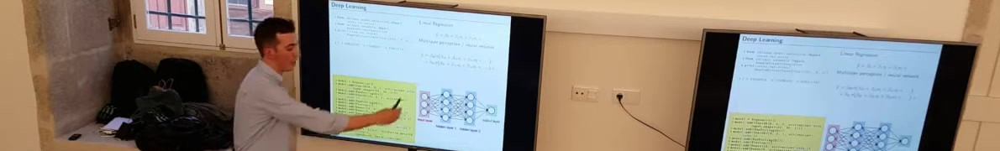

Ricardo Cruz received a B.S. degree in computer science and an M.S. degree in applied mathematics, both from the University of Porto, Portugal. Since 2015, he has been a researcher at INESC TEC working in machine learning with particular emphasis on computer vision. He earned his Ph.D. in Computer Science in 2021 with a special emphasis on computer vision and deep learning. Currently, he is a post-doctoral researcher on autonomous driving under the THEIA research project, a partnership between the University of Porto and Bosch Car Multimedia.

Skills: Python • C • C++ • Java • R • MATLAB • PyTorch • TensorFlow • OpenCV • SQL • Git

#  Education

+ 2021 Ph.D.: Computer Science (joint degree University of Porto, Minho and Aveiro)
+ 2015 M.Sc.: Mathematical Engineering (University of Porto)
+ 2012 B.Sc.: Computer Science (University of Porto)

#  Employment

+ 2021--...: **Post-doctoral Researcher** on Autonomous Driving
    University of Porto (FEUP) [in partnership with Bosch]
  - Collaboration between the University of Porto and Bosch Car Multimedia to improve autonomous driving perception
  - Developed frameworks for object detection using camera and LiDAR (2D discretization and raw point-clouds)
  - Published new methods for efficient semantic segmentation and ordinal regression
  - Supervised six master's theses, four bachelor's projects, and other team members
  - Responsible for the HPC infrastructure (using Slurm)
+ 2015--2021: **Research Assistant** on Machine Learning and Computer Vision
    INESC TEC
  - Research focus: re-thinking fundamentals about image classification and semantic segmentation (8+ publications)
  - Some highlights: (1) a method for background invariance using adversarial training, (2) new losses that minimize absolute trade-offs between Type 1 and 2 errors instead of relative trade-offs, (3) using backpropagation also for inference to refine existing outputs, (4) deploying learning-to-rank methods for class imbalance
  - Contributed to workshops, Summer School on Computer Vision (VISUM), and other events
  - Twice awarded "outstanding recognition" for organizing workshops and helping with the HPC infrastructure
+ 2014: **Research Grant** on Mathematical Modelling Research
    Mathematics Center of the University of Porto (CMUP)
  - Epidemiological models for HIV. A little of everything: from differential equations to stochastic simulations to cellular automata.

#  Teaching

+ 2021--2022: **Invited Auxiliary Professor,** University of Porto (FEUP)
+ 2018--2021: **Invited Teacher Assistant,** University of Porto (FEUP)

#  Courses

The teaching consisted of the pratical lessons (2h-4h per week) and helping with the materials. These courses took place during my PhD (as an Invited Teacher Assistant) and then as a Post-Doc (as an Invited Auxiliary Professor).

* L.EIC003: Programming Fundamentals (Python) [L.EIC] (2018/2019, 2019/2020, 2020/2021, 2021/2022) 
* L.EIC009: Programming (C/C++) [L.EIC] (2019/2020, 2020/2021) 
* L.EEC009: Data Structures and Algorithms (C/C++) [L.EEC] (2021/2022) 

#  Awards

+ 2022: **Bosch for Mobility:** My students won Best New Participating Team in an autonomous driving competition 
+ 2021: **INESC TEC Outstanding Recognition Award:** Monthly award for INESC TEC collaborators, for maintenance of the HPC infrastructure 
+ 2021: **Pedagogic award (voted by students):** University of Porto (FEUP)
+ 2021: **Best paper and presentation:** RECPAD conference 
+ 2018: **INESC TEC Outstanding Recognition Award: Monthly award for INESC TEC collaborators, for organizing workshops 
+ 2017: **Kaggle Bronze Medal (competition) and Silver (engagement)**

#  Selected Projects

See my github for more projects: [github.com/rpmcruz](https://github.com/rpmcruz?tab=repositories).

* **Uber Pixor implementation.** Implementation of a popular bird's eye view LiDAR object detection model. 
* **objdetect package.** Light-weight and versatile one-stage object detection framework. 
* **Human Feedback during Neural Network Training.** When a model makes a wrong prediction, a typical solution is to acquire more data related to the error -- this is an expensive process known as active learning. Our proposal combines active learning with interpretability so the user can correct such mistakes while the model trains. This work resulted in a thesis that I supervised.
* **Neural Networks Robust to Background Changes.** While training an electrical insulator detector, we noticed a large drop in accuracy when going from the controlled studio (training set) to outdoors (testing set). The proposed method uses a background generator to generate adversarial backgrounds and a mask generator to introduce this background to the training image. A paper was published from this work. 
* **Annotation Aid Tool using GrabCut.** Annotations were necessary for a project whose goal was to learn a sequential segmentation model for the movement of mice. For that purpose, I developed a small tool to aid the annotation effort. The tool processes the video frames sequentially in two steps: (1) the annotator first selects the region where the mouse is, and (2) the annotator selects some positive pixels (left-click) and negative pixels (right-click) until he/she is satisfied with the segmentation produced by the GrabCut algorithm. 
* **Classification of Cervical Cancer Risk.** Cervical cancer is the fourth leading cause of cancer-related deaths in women. The goal of the TAMI project was to automate cervical cancer screening via Pap smears. A non-parametric ordinal loss for neuronal networks was proposed to promote ordinal output probabilities (accuracy of 75.6% for seven classes and 81.3% for four classes). A paper was published based on this work. 
* **Apoo (virtual machine) GTK+ interface.** I helped with the development of the GTK+ interface for Apoo (together with Profs Rogério Reis and Nelma Moreira), a virtual machine that is currently being used to teach Assembly. Apoo is written in Python and GTK+. 
* **EatFeed.** RSS/Atom reader written in C++ and GTK+. 
* **Google Summer of Code.** I was awarded twice a Google grant to work on open-source projects. LibreOffice dynamic layouts (2007) and YaST port from GTK+ to Qt (2006).
* **J2ME and Android games.** Games written in Java Mobile Edition; more recently, I ported a couple of them to Android. 
* **SuperTux, co-author.** While in high-school, I was part of the initial team developing this game. It is written in C++, SDL, and OpenGL. 

#  Participation in Scientific Projects

* Post-doc researcher (2021--2023) on THEIA -- Automated Perception Driving (POCI-01-0247-FEDER-047264) 
* Research member (2018--2021) of CLARE -- Computer-aided cervical cancer screening (POCI-01-0145-FEDER-028857) 
* Masters research grant (2015--2016) on NanoSTIMA -- Macro-to-Nano Human Sensing: Towards Integrated Multimodal Health Monitoring and Analytics (NORTE-01-0145-FEDER-000016)
* Bachelors research grant on statistical epidemiological modelling (2014) (PEst-C/MAT/UI0144/2013)

#  Participation in Scientific Events

* **5th International Conference on Sustainable Technologies for Industry 5.0** (STI 2023): Technical Program Committee member 
* **iMIMIC/MIL3ID/LABELS 2020 workshop proceedings** (MICCAI 2020): co-editor 
* **iMIMIC 2020 workshop** (MICCAI 2020): committee sponsor chair 
* **3rd International Conference on Dynamics, Games and Science (2014):** president of the organizing committee 

#  Participation in Workshops or Competitions

* 2022: **Bosch for Mobility:** My students won Best New Participating Team in an autonomous driving competition promoted by Bosch Romania. 
* 2019: **DSPT Day:** lightning talk (a two-day machine learning event for a public audience)
* 2018: **Junior University:** organized with my supervisor (Prof. Jaime Cardoso) an activity for the Junior University entitled "Escondidos nos Dados". The Junior University is an opportunity that the University of Porto gives children to get to know and do activities at the university. This activity took place for a month, with classes with different children every day, from the 8th and 9th grades. The website archives is not working, but this link describes an award I received from INESC TEC for organizing these activities, among others. 
* 2018: **VISUM:** helped prepare a computational framework in which students submitted processes and generated Kaggle-style leaderboards (using Google Cloud) for the competitions that take place during the VISUM computer vision summer school, a framework that continues to be used today.
* 2017: organized some workshops, especially at INESC TEC, namely **Learning from Data**, which was part of the CTM Open Day. (The CTM is the INESC TEC unit that I was part of.) 
* 2017: Free public workshop, in collaboration with João Machado, in the **Python Meetup** entitled *NumPy and Scikit-Learn*. The Python Meetup was a monthly meeting about Python in Porto, which has since been discontinued. 

#  Impact and Citations

* Google Scholar (may/2023): 171 citations, 7 h-index 
* Web of Science (may/2023): 73 citations, 4 h-index 
* Scopus (may/2023): 111 citations, 5 h-index 
* Best oral paper: 2021 RECPAD conference 

###  Conference Publications

My favorite publications are in ==highlight==, including a summary of the main contributions for those papers.

1. **Ricardo P. M. Cruz**, ASM Shihavuddin, Hasan Maruf, Jaime S. Cardoso. Active Supervision: Human in the Loop. **[ACCEPTED]** *Springer Iberoamerican Congress, CIARP 2023* **CORE RANK=C**
1. Diana Teixeira Silva, **Ricardo P. M. Cruz**. Condition Invariance for Autonomous Driving by Adversarial Learning. **[ACCEPTED]** *Springer Iberoamerican Congress, CIARP 2023* **CORE RANK=C**
1. Filipe Campos, Francisco Gonçalves Cerqueira, **Ricardo P. M. Cruz**, Jaime S. Cardoso. YOLOMM -- You Only Look Once for Multi-modal Multi-tasking. **[ACCEPTED]** *Springer Iberoamerican Congress, CIARP 2023* **CORE RANK=C**
1. J Barbero-Gómez, **R. Cruz**, JS Cardoso, PA Gutiérrez, C Hervás-Martínez (2023). Evaluating the Performance of Explanation Methods on Ordinal Regression CNN Models. *Springer International Work-Conference on Artificial Neural Networks*  **CORE RANK=n/a**
1. ==P. S. Silva, **R. Cruz**, ASM Shihavuddin, T. Gonçalves (2023). Interpretability-Guided Human Feedback During Neural Network Training. *Springer Iberian Conference on Pattern Recognition and Image Analysis (Ibpria)*==  **CORE RANK=C**
    * In this article, which resulted from a master's thesis supervision, the objective was that the human could provide feedback during the optimization process. Usually, the role of the human is only to make notes on the data, and then the optimization process is automatic. When the model falls below expectations it is necessary to collect more data and re-annotate them. In this work, interpretability tools are used to identify the image regions that are influencing the model result the most, then the user is asked whether any of these regions should not be responsible for the decision. This user feedback is then integrated into the loss to penalize the model if it continues to focus on these regions. A small improvement of the approach was noted in regimes where there is little data.
1. D. Silva, **R. Cruz**, T. Gonçalves, D. Carneiro (2023). Two-stage Semantic Segmentation in Neural Networks. *Proceedings of the Fifteenth International Conference on Machine Vision (ICMV)*  **CORE RANK=C**
1. ==**R. Cruz**, R. Prates, E. Filho, J. Costa, J. Cardoso (2021). Background Invariance by Adversarial Learning. *IEEE 25th International Conference on Pattern Recognition (ICPR)*==  **CORE RANK=B**
    * Convolutional neural networks (CNNs) are vulnerable to changes in the background of the image: for example, training a CNN with the popular MNIST digit recognition dataset we easily achieved an accuracy of close to 100\%; however, if we replace the background (which is white) with stripes, the accuracy drops to 40\%, and if we replace it with noise then the accuracy can drop to 10\%. The proposed method consists of three neural networks trained together (end-to-end): (1) the classification CNN $f$ that we want to make more robust; (2) a CNN $s$ that does a coarse segmentation of the object; (3) a CNN $g$ that generates possible backgrounds for the image. During inference, only the $f$ model is used, $y=f(x)$, where $x$ is the input image. The models $s$ and $g$ are only used during the optimization process, $y=f(g(\epsilon)+x\otimes s(x))$, where $\epsilon$ is white noise and $\otimes$ is the element-by-element product. The models are optimized in an adversarial way: $\min_{f,s} Loss(y)$ and the model $g$ tries to generate funds that make the job as difficult as possible, $\max_g Loss(y)$. To prevent the $g$ template from generating objects from other classes as background, the $g$ template only generates independent subregions that are then concatenated. The optimization is inspired by other adversarial neural networks, such as GANs, although it is not a GAN as there is no discriminator, nor are there examples of realistic backgrounds. The case study explores a fault detection dataset in electrical insulators, collected by a co-author from UFBA (Brazil). Here the objective was to be able to train with insulators, whose photographs were collected in a controlled environment in a laboratory, and it was intended that the model was robust enough to be able to detect defects in conditions later in the real world, in which the background of objects is very different. of the laboratory.
1. **R. Cruz**, J. Costa, J. Cardoso (2019). Automatic Augmentation by Hill Climbing. *Springer 28th International Conference on Artificial Neural Networks (ICANN)*  **CORE RANK=C**
1. ==**R. Cruz**, J. Costa, J. Cardoso (2019). Averse Deep Semantic Segmentation. *IEEE 41st Engineering in Medicine and Biology Conference (EMBC)*==  **CORE RANK=C**
    * In binary tasks we can consider two types of errors: type I errors (false negatives) and type II errors (false positives). There is an inherent trade-off between these two types of errors: we can reduce the false positive rate (FPR) by increasing the false negative rate (FNR) and vice versa. The common way to define this commitment is through a cost matrix: we are defining that we tolerate $\alpha$ errors of one type of error as $\beta$ errors of the other type, $\min \alpha\text{FPR} +\beta\text{FNR}$. However, this way of establishing relative errors may not be the most natural. It might be more natural for the definition to be absolute: we tolerate at most up to $X$ of one type of error, minimizing errors of the other type, $\min \text{FPR}, \text{subject to } \text{FNR} \ leq X$. This way of defining an absolute error on one of the error types forces us to rethink the optimization process. In this work, approaches such as the use of thresholds, adding a term to the loss and optimizing with two alternating objectives were proposed.
1. **R. Cruz**, M. Silveira, J. Cardoso (2018). A Class Imbalance Ordinal Method for Alzheimer's Disease Classification. *IEEE International Workshop on Pattern Recognition in Neuroimaging (PRNI)*  **CORE RANK=n/a**
1. ==K. Fernandes, **R. Cruz**, J. Cardoso (2018). Deep image segmentation by quality inference. *IEEE International Joint Conference on Neural Networks (IJCNN)*==  **CORE RANK=B**
    * Traditionally, neural networks model a function $f$, such that $y=f(x)$, where $x$ is the input and $y$ the output of the neural network. Inference in neural networks is therefore done in just one step, unlike other classic models in which inference is iterative, which allows improving existing solutions and greater transparency in processing. The proposal is that of a neural network that produces the quality of a pair (input, output): $q=f(x,y)$, where q is the function that models the quality produced by the model. In this way, the output $y$ can then be iteratively and gradually improved through a gradient ascent process: $y_{t+1}=y_t+\frac{\partial f(x,y_t)}{\partial y_t }$, for each iteration $t$. This approach was applied to semantic segmentation, with $y_0$ being a completely black segmentation.
1. **R. Cruz**, K. Fernandes, J. Costa, J. Cardoso (2017). Constraining type II error: building intentionally biased classifiers. *Springer International Work-conference on Artificial Neural Networks (IWANN)*  **CORE RANK=n/a**
1. M. Pérez-Ortiz, K. Fernandes, **R. Cruz**, J. Cardoso (2017). Fine-to-coarse ranking in ordinal and imbalanced domains: an application to liver transplantation. *Springer International Work-conference on Artificial Neural Networks (IWANN)*  **CORE RANK=n/a**
1. **R. Cruz**, K. Fernandes, J. Costa, M. Pérez-Ortiz, J. Cardoso (2017). Combining ranking with traditional methods for ordinal class imbalance. *Springer International Work-conference on Artificial Neural Networks (IWANN)*  **CORE RANK=n/a**
1. "**R. Cruz**, K. Fernandes, J. Costa, M. Pérez-Ortiz, J. Cardoso (2017). Ordinal class imbalance with ranking. *Springer Iberian conference on pattern recognition and image analysis (Ibpria)*  **CORE RANK=C**
1. ==**R. Cruz**, K. Fernandes, J. Costa, J. Cardoso (2016). Tackling class imbalance with ranking. *IEEE International Joint Conference on Neural Networks (IJCNN)*==  **CORE RANK=B**
    * In automatic classification tasks, it is common to have a disproportion between the number of copies of each class, something known as "class imbalance." In the binary case, the minority class contributes little to the decision frontier because the optimization is done considering each point in isolation. Conventional solutions consist of: resampling the data to balance them (pre-processing) or assigning different weights to each class (optimization) or fine-tuning the decision frontier threshold (post-processing). The proposal consists of using the same optimization process that is used in pairwise sorting methods in the ``learning to rank'' literature. These models minimize losses using pairs of observations, $Loss(f(x1), f(x2))$. In our adaptation for binary classification, the optimization is done by comparing an observation of a class with an observation of another class, causing the "class imbalance" to disappear automatically in the binary case, since the loss always takes into account observations of both classes.

###  Journal Publications

The SJR rank is from [SJR Scimago](https://www.scimagojr.com/), quantiles from 2022.

1. **R. Cruz**, D. Silva, T. Gonçalves, D. Carneiro, J. Cardoso (2023). Two-Stage Framework for Faster Semantic Segmentation. *MDPI Sensors*  **Q2 (eletrical engineering)**
1. T. Albuquerque, L. Rosado, **R. Cruz**, M. Vasconcelos, T. Oliveira, J. Cardoso (2023). Rethinking Low-Cost Microscopy Workflow: Image Enhancement using Deep Based Extended Depth of Field Methods. *Elsevier Intelligent Systems with Applications*  **Q1 (computer vision and pattern recognition)**
1. T. Albuquerque, **R. Cruz**, J. Cardoso (2022). Quasi-Unimodal Distributions for Ordinal Classification. *MDPI Mathematics*  **Q2 (computer science)**
1. T. Albuquerque, **R. Cruz**, J. Cardoso (2021). Ordinal Losses for Classification of Cervical Cancer Risk. *PeerJ Computer Science*  **Q2 (computer science)**
1. R. Prates, **R. Cruz**, A. Marotta, R. Ramos, E. Filho, J. Cardoso (2019). Insulator visual non-conformity detection in overhead power distribution lines using deep learning. *Elsevier Journal Computers & Electrical Engineering*  **Q1 (computer science)**
1. **R. Cruz**, K. Fernandes, J. Costa, M. Pérez Ortiz, J. Cardoso (2018). Binary ranking for ordinal class imbalance. *Springer Journal Pattern Analysis and Applications*  **Q2 (computer vision and pattern recognition)**

#  Collaborations as Editor or Evaluator

+ 2021: **A3ES:** student member (as a PhD student) of three evaluation committees: a master's course and two doctorates.
+ 2020: **iMIMIC/MIL3ID/LABELS 2020 workshop proceedings (MICCAI 2020):** helped organize the iMIMIC 2020 workshop (part of MICCAI 2020) and was later co-editor of the publication of the joint proceedings of three MICCAI 2020 workshops.

#  Jury Participation

+ 2023: Luís Miguel Mendonça Almeida: *Yes, No, Maybe: Uncertainty Estimation in Autonomous Driving* (FCUP, External Examiner)
+ 2023: João Jesus Figueiredo: *Application of AI Techniques in Video* (FCUP, External Examiner)
+ 2023: Ricardo Ribeiro: *AI-based models to predict the Traumatic Brain Injury outcome* (FCUP, External Examiner)
+ 2022: Mafalda Oliveira: *Neuroblastoma Cancer Radiogenomics* (FEUP, External Examiner)
+ 2022: João Pedro Fonseca: *AI-Based Models to Predict The Traumatic Brain Injury Outcome* (FEUP, External Examiner)
+ 2022: Ana Maria Sousa: *Learning to write medical reports from EEG data* (FEUP, Chairman)
+ 2022: Bruno Nascimento: *Detection and classification of small impacts on vehicles based on deep learning algorithms* (U. Minho, External Examiner)
+ 2021: Artur Ferreira: *3D Lung Computed Tomography Synthesis using Generative Adversarial Networks* (FCUP, External Examiner)
+ 2021: Vítor Figueiredo: *Feasibility of using autoencoders for learning car interior background models* (U. Minho, External Examiner)

#  M.Sc. Supervisions

+ on-going: Airton Tiago: *Data Augmentation for Ordinal Data* (FEUP)
+ on-going: Francisco Gonçalves Cerqueira: *Comparative Study on Self-Supervision Methods for Autonomous Driving* (FEUP)
+ on-going: Diana Teixeira Silva: *Quantifying How Deep Implicit Representations Promote Label Efficiency* (FEUP)
+ 2023: Alankrita Asthana: *Iterative Inference for Point-Clouds* (TUM, Munich)
+ 2023: Rafael Cristino (with J. Cardoso): *Introducing Domain Knowledge to Scene Parsing in Autonomous Driving* (FEUP)
+ 2023: José Guerra (with L. Teixeira): *Academic Internship in Out of Distribution Detection – Autonomous Driving* (Internship at Bosch Car Multimedia) (FEUP)
+ 2022: Pedro Silva (with T. Gonçalves): *Human Feedback during Neural Networks Training* (FEUP) 
+ 2022: João Silva: *Environment Detection for Railway Applications based on Automotive Technology* (Internship at Continental) (FEUP) 
+ 2022: Ana Bezerra (with J. Costa): *Phishing Detection with a Machine Learning Net* (Internship at E-goi) (FCUP) 

#  B.Sc. Projects Supervisions

+ on-going: Eliandro Melo: *Resource Efficiency using Deep Q-Learning in Autonomous Driving* (FCUP)
+ on-going: Ivo Duarte Simões: *Resource Efficiency using PPO in Autonomous Driving* (FCUP)
+ 2023: Diana Silva: *Condition Invariance for Autonomous Driving by Adversarial Learning* (FEUP)
+ 2022: Diana Silva (with T. Gonçalves): *Semantic Segmentation in Neural Networks using Iterative Visual Attention* (FEUP)
+ 2022: Filipe Campos, Francisco Cerqueira, Vasco Alves: *Mobile App using Object Detection for Car Driving* (FEUP)
+ 2022: Bruno Gomes, Rafael Camelo: Internship at ANO (FEUP)
